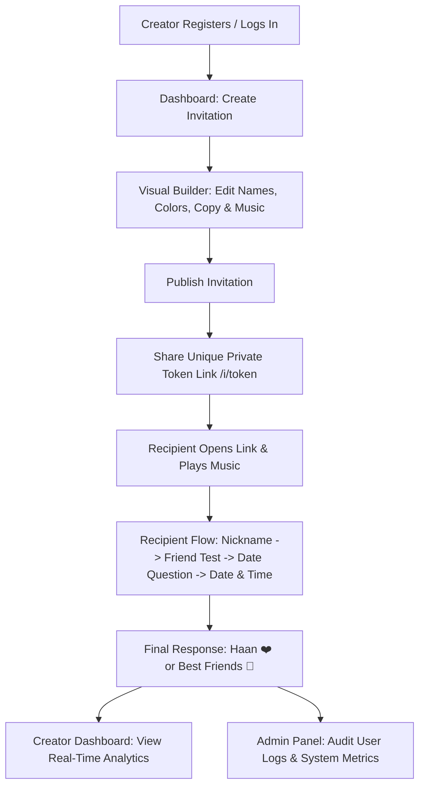

# Ask Her Out 💌

**Ask Her Out** is a full-stack, modern web application designed for creating and sharing personalized, interactive, and playful date invitations. Built with a focus on romantic proposals, Hinglish date invitations, and best-friend-to-date flows, it combines visual customization, live previewing, interactive recipient journeys, first-party analytics, and an integrated Admin Control Panel.

Repository: [github.com/ShivPatel412/Ask-Her-Out](https://github.com/ShivPatel412/Ask-Her-Out)

---

## 🌟 Key Features

### 1. Visual Invitation Builder & Live Preview
- **Quick Setup & Customization**: Create an invitation in under a minute or customize every aspect.
- **Custom Copy & Questions**: Rewrite headings, subheadings, friendship analysis, date questions, and button text.
- **Theme & Color Customization**: Curated HSL color palettes, modern fonts, and glassmorphic designs.
- **Cute Extras**: Mascot selection, confetti celebrations, date idea collectibles, and toggleable Hinglish modes.
- **Live Device Preview**: Real-time preview iframe with mobile, tablet, and desktop viewport toggles.

### 2. Interactive Recipient Journey
- **Respectful & Playful Flow**: Recipient can choose custom nicknames, complete funny friendship tests, pick exact date/time options, select date moods (e.g., Coffee, Long Drive + Food, Movie), and answer **Haan 😌♥** or **Best Friends 🤝**.
- **No Pressure Outcomes**: Clean alternative paths ensuring respectful interactions.
- **Glass Music Player**: Recipient can listen to a custom favorite song uploaded by the creator with playback, volume, and progress controls.

### 3. Analytics & Recipient Tracking
- **First-Party Interaction Analytics**: Track total sessions, unique visitors, response outcomes, average interaction steps, and revisits.
- **Ordered Event Journey**: View every step the recipient took through the invitation flow.

### 4. Admin Control Panel 👑 (`/admin`)
- **System Metrics Overview**: Total registered users, invitations created, published links, visitor sessions, and security logs.
- **User Accounts Management Table**: Comprehensive table listing all registered users (`ID`, `Username`, `Email`, `WhatsApp Number`, `Role Badge`, `Registration Date`).
- **Security & Authentication Activity Logs (`user_logs`)**: Real-time activity table tracking user actions (`REGISTER`, `LOGIN`, `LOGOUT`, `FAILED_LOGIN`) with IP address, user agent, and timestamps.

### 5. Private SQLite Storage
- **Native File Database**: Data stored securely in local SQLite database ([`data/app.db`](file:///c:/Users/patel/Documents/Codex/2026-08-10/i/outputs/date-invite-builder/data/app.db)).
- **No Third-Party Exposure**: All logs, user details, and invitations remain stored on your system for direct inspection via SQLite Viewer or CLI.

---

## 🔄 How It Works (Application Workflow)



### 1. Creator Workflow
1. **Account Creation**: Register an account or log in. (The first registered user or `info@shivpatel.in` automatically becomes `superadmin`).
2. **Invitation Studio**: Click **Create Invitation** to start from the *Best Friend → Date* template.
3. **Visual Customization**: Customize colors, fonts, questions, mascots, date options, and optionally upload a favorite song (MP3/OGG/WAV).
4. **Publish & Share**: Click **Publish Invitation** to generate a unique random URL (`/i/<public-token>`).
5. **Review Responses**: Open **Analytics** from the dashboard to see recipient choices and final responses.

### 2. Recipient Workflow
1. **Opening the Link**: Recipient opens `/i/<token>`. Audio player activates upon tapping **Open it**.
2. **Interactive Steps**:
   - Chooses a nickname (e.g. *Drasti*, *Favorite Human*).
   - Runs the funny *Friendship Analysis*.
   - Reads the date question and explores date ideas (Coffee, Dinner, Drive, Movie).
   - Selects an exact date & time.
3. **Final Response**: Selects **Haan 😌♥** (triggers confetti celebration) or **Best Friends 🤝**.
4. **WhatsApp Connection**: Optional direct button opens WhatsApp chat with the creator.

### 3. Superadmin Workflow
1. Log in with a `superadmin` account (`sastatengo` / `info@shivpatel.in`).
2. Click **`👑 Admin`** in the top navigation bar to open `/admin`.
3. View **Registered Users**, **Security Logs**, and **Invitations Across System**.

---

## ⚡ Default Superadmin Credentials

Upon database initialization, the default superadmin account is configured as:

| Property | Value |
| --- | --- |
| **Username** | `sastatengo` |
| **Email** | `info@shivpatel.in` |
| **Password** | `Shiv@412` |
| **Mobile No** | `6351149722` |
| **Role** | `superadmin` |

---

## 🛠️ Technology Stack

| Component | Technology |
| --- | --- |
| **Runtime & Framework** | Node.js 20+, Next.js (16.3+ Turbopack) + Express.js backend adapter |
| **Database** | SQLite via `better-sqlite3` with WAL mode & foreign keys |
| **Sessions** | `express-session` backed by persistent SQLite `web_sessions` table |
| **Authentication** | `bcryptjs` password hashing (cost factor 12) |
| **Security & Headers** | CSRF tokens, Helmet security headers, rate limiting (`express-rate-limit`) |
| **Styling** | Vanilla CSS (CSS variables, glassmorphism, responsive grid & flexbox) |
| **Testing** | Native Node.js test runner (`node --test`) |

---

## 🚀 Getting Started (Local Setup)

### 1. Prerequisites
- Node.js 20 or newer
- npm 10 or newer

Check your versions:
```bash
node -v
npm -v
```

### 2. Installation
Clone the repository and install dependencies:
```bash
git clone https://github.com/ShivPatel412/Ask-Her-Out.git
cd Ask-Her-Out
npm install
```

### 3. Environment Configuration
Create a `.env.local` or `.env` file in the project root:
```env
PORT=3000
NODE_ENV=development
SESSION_SECRET=your_long_random_session_secret_key_here
SUPERADMIN_EMAIL=info@shivpatel.in
```

### 4. Running Development Server
Start the development server:
```bash
npm run dev
```
Open [http://localhost:3001](http://localhost:3001) in your browser.

---

## 🗄️ Database Schema & File Structure

All runtime data is stored in [`data/app.db`](file:///c:/Users/patel/Documents/Codex/2026-08-10/i/outputs/date-invite-builder/data/app.db).

```text
Ask-Her-Out/
├── pages/
│   └── api/
│       └── express/
│           └── [[...path]].js       # Next.js API catch-all wrapper for Express
├── public/
│   ├── assets/
│   │   ├── css/
│   │   │   ├── app.css              # Dashboard, auth, admin, and builder styles
│   │   │   └── invitation.css       # Recipient invitation & music player styles
│   │   ├── images/                  # UI illustrations and mascot assets
│   │   └── js/                      # Frontend JavaScript modules
├── src/
│   ├── database.js                  # SQLite table definitions & indices
│   ├── next-express.js              # Express-to-Next.js compatibility bridge
│   └── template.js                  # Default invitation content & color presets
├── test/
│   └── app.test.js                  # Automated test suite
├── data/
│   ├── app.db                       # Primary SQLite database file
│   └── uploads/                     # User-uploaded audio files
├── server.js                        # Express server routes, logic, and APIs
├── package.json                     # Scripts and dependencies
└── README.md                        # Documentation
```

### Main Database Tables

1. **`users`**: User accounts (`id`, `email`, `username`, `password_hash`, `whatsapp_number`, `role`, `created_at`, `updated_at`).
2. **`user_logs`**: Activity audit logs (`id`, `user_id`, `email`, `action`, `ip_address`, `user_agent`, `created_at`).
3. **`invitations`**: Invitation configurations (`id`, `owner_user_id`, `public_token`, `title`, `status`, `theme_config_json`, `content_config_json`, `feature_config_json`).
4. **`visitor_sessions`**: Anonymous recipient session tracking (`id`, `invitation_id`, `visitor_id`, `final_result`, `selected_mood`, `selected_date`).
5. **`events`**: Interaction step log per visitor session (`id`, `session_id`, `event_name`, `sequence_number`).
6. **`web_sessions`**: Persistent user login sessions.

---

## 📌 Available Scripts

| Command | Description |
| --- | --- |
| `npm run dev` | Starts the Next.js development server with hot reloading |
| `npm run build` | Builds the production bundle |
| `npm start` | Starts the built production server |
| `npm test` | Runs the full integration test suite |

---

## 🔒 Security & Privacy

- Passwords are hashed using bcrypt with a cost factor of 12.
- Session cookies are signed and stored in SQLite.
- Write requests require CSRF token validation.
- SQLite queries use parameterized statements to prevent SQL injection.
- Security activity is logged in `user_logs` for auditability.

---

## 🤝 Contributing & License

Designed and developed by **[Shiv Patel (SastaTengo)](https://shivpatel.in)**.  
Repository: [github.com/ShivPatel412/Ask-Her-Out](https://github.com/ShivPatel412/Ask-Her-Out)