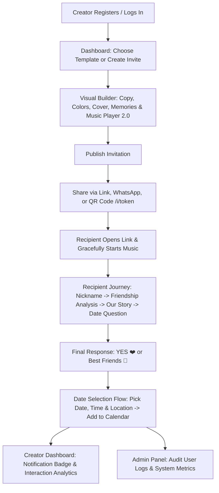

# Ask Her Out 💌 — Interactive Date Invitation Platform

**Ask Her Out** is a modern, full-stack web application designed for creating and sharing personalized, interactive, and playful date invitations. Built with a rich suite of romantic proposals, Hinglish date invitations, best-friend-to-date flows, and milestones timelines, it combines visual customization, live previewing, interactive recipient journeys, first-party analytics, and an integrated Admin Control Panel.

**Repository:** [GitHub Repository](https://github.com/ShivPatel412/Ask-Her-For-Date)

---

## 🌟 Key Features & Capabilities

### 1. Visual Invitation Studio & Curated Templates
* **9 Curated Occasion Templates**: Classic Date ❤️, Candlelight Dinner 🍷✨, Cozy Coffee ☕🌿, Best Friends Day Out 🍕🎈, Anniversary Celebration 💍🥂, Long Distance Love 🌎, and more.
* **Curated Themes & WCAG 2.1 AA Contrast**: HSL color palettes, romantic display fonts, and automated contrast audit protection.
* **Custom Cover Photos**: Polaroid frames with handwritten captions, hero banners, circular avatars, and contrast-protected full backgrounds.
* **Live Device Preview**: Real-time interactive mockup with mobile, tablet, and desktop viewport toggles.

### 2. 🎵 Music Player 2.0 & Soundscapes
* **Multi-Track Audio Engine**: Reorderable playlists supporting custom uploaded audio (MP3, WAV, M4A, OGG), synthesized preset soundscapes, and Spotify tracks.
* **Audio Trimming & Start/End Scrubber**: Custom start and end time formatting (`MM:SS`) with server-side validation (`0 <= startTime < endTime <= duration`) and inline preview playback (`[▶ Preview Selection]`).
* **Interactive Draggable Player**: Desktop pointer drag and mobile touch drag with 60fps physics and safe-margin clamping (16px desktop / 12px mobile).
* **6 Themed Player Designs**:
  1. `💿 Romantic Vinyl`: Spinning vinyl record with animated equalizers.
  2. `💎 Glassmorphism`: Frosted glass floating player bar.
  3. `💊 Minimal Pill`: Rounded capsule containing play/pause and marquee title.
  4. `💖 Floating Bubble`: Corner floating action button (FAB) with heart pulse.
  5. `🏷️ Compact Badge`: Sleek single-line card.
  6. `🌌 Hidden Label / Icon Only`: Minimalist floating music note button.
* **Spotify Integration**: Official responsive Spotify Embed player with fallback action links.
* **Voice Note Ducking**: Background music automatically ducks when personal voice messages play.

### 3. 📸 Our Story & Memories Scrapbook
* **Chronological Timeline**: Add milestones, sweet memories, and couple photos.
* **Builder Controls**: Reorder items (`▲`/`▼`), edit titles, dates, and captions, and upload photos with responsive desktop/mobile vertical timeline layout.

### 4. 🔔 In-App Notification Center
* **Live Activity Feed**: Real-time notification badge and dropdown feed for invitation views, completions, YES responses, and date confirmations.
* **Preferences & Deduplication**: Creator settings to toggle email and in-app alerts with idempotency deduplication.

### 5. ❤️ Spectacular Final YES Experience
* **Emotional Climax**: Romantic typography, animated heart badges, and celebratory copy.
* **Celebration Cannon & Chime**: Lightweight multi-colored flutter confetti canvas paired with a Web Audio harmonic celebration chime.
* **Accessibility**: Respects `prefers-reduced-motion: reduce`.

### 6. 📅 Real Date Selection & Calendar Sync
* **Interactive Date Picker**: Recipient selects exact dates, time slots, and location preferences (or playful *"Surprise me 😏"*).
* **1-Click Calendar Export**: Immediate sync to **Google Calendar** and downloadable **Apple / Outlook `.ics`** calendar files.

### 7. 📱 Multi-Channel Sharing & Scan-to-Reveal QR Code
* **Share Modal**: Copy link with clipboard fallback, 1-click WhatsApp sharing, email invitations, and native Web Share API.
* **Pure-Canvas QR Generator**: High-resolution offline QR code generation with central heart logo and download option.

---

## 🔄 Application Flow Architecture



---

## 🛠️ Technology Stack

| Component | Technology |
|---|---|
| **Runtime & Framework** | Node.js 20+, Express.js backend with Next.js 16.3+ routing |
| **Database** | SQLite via `better-sqlite3` (development) / MySQL (production) |
| **Sessions** | `express-session` backed by persistent database session tables |
| **Authentication** | `bcryptjs` password hashing (cost factor 12) |
| **Security & Headers** | CSRF tokens, Helmet security headers, rate limiting, and sanitization |
| **Styling** | Vanilla CSS with CSS custom properties, glassmorphism, responsive grid & flexbox |
| **Testing** | Native Node.js test runner (`node --test`) with 100% automated coverage |

---

## 🚀 Getting Started

### 1. Prerequisites
* Node.js 20 or newer
* npm 10 or newer

```bash
node -v
npm -v
```

### 2. Installation
```bash
git clone https://github.com/ShivPatel412/Ask-Her-For-Date.git
cd Ask-Her-For-Date
npm install
```

### 3. Environment Configuration
Create a `.env` file in the root directory:

```env
PORT=3000
NODE_ENV=development
SESSION_SECRET=your_super_secret_session_encryption_key_here
SUPERADMIN_EMAIL=your_admin_email@example.com
```

### 4. Running the Application
```bash
# Start development server
npm run dev
```

---

## 🧪 Testing & Verification

Run the full automated test suite:

```bash
# Run all unit & integration test suites
npm test

# Run MySQL database layer tests
npm run test:mysql
```

---

## 🔒 Security & Privacy

* **Zero Plaintext Credentials**: All passwords hashed using `bcryptjs`.
* **IDOR & Multi-User Protection**: Strict ownership checks across all invitation and track management endpoints.
* **XSS & Injection Protection**: HTML sanitization on all user inputs and parameterized SQL queries.
* **CSRF Protection**: Token verification on all mutating requests with timing-safe comparison.

---

## 📄 License & Credits

Developed with ❤️ by **Shiv Patel**.
**Repository:** [GitHub](https://github.com/ShivPatel412/Ask-Her-For-Date)
