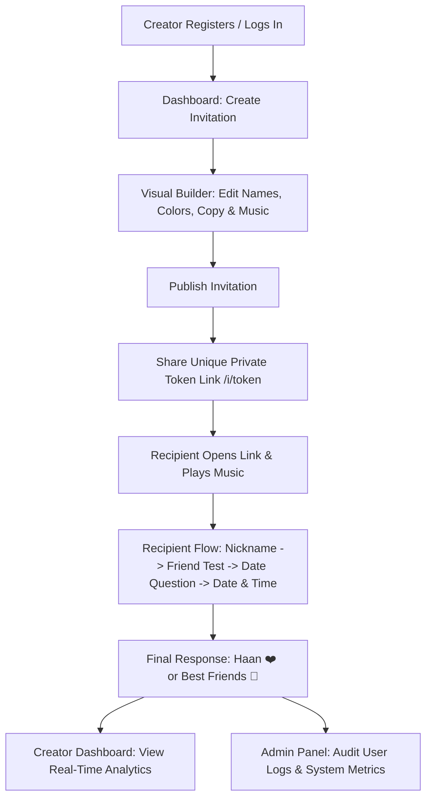

# Ask Her Out 💌

**Ask Her Out** is a full-stack, modern web application designed for creating and sharing personalized, interactive, and playful date invitations. Built with a focus on romantic proposals, Hinglish date invitations, and best-friend-to-date flows, it combines visual customization, live previewing, interactive recipient journeys, first-party analytics, and an integrated Admin Control Panel.

**Repository:** [GitHub Repository](https://github.com/ShivPatel412/Ask-Her-Out)

---

## 🌟 Key Features

### 1. Visual Invitation Builder & Live Preview

* **Quick Setup & Customization:** Create an invitation in under a minute or customize every aspect.
* **Custom Copy & Questions:** Rewrite headings, subheadings, friendship analysis, date questions, and button text.
* **Theme & Color Customization:** Curated HSL color palettes, modern fonts, and glassmorphic designs.
* **Cute Extras:** Mascot selection, confetti celebrations, date idea collectibles, and toggleable Hinglish modes.
* **Live Device Preview:** Real-time preview iframe with mobile, tablet, and desktop viewport toggles.

### 2. Interactive Recipient Journey

* **Respectful & Playful Flow:** Recipient can choose custom nicknames, complete funny friendship tests, pick exact date/time options, select date moods such as Coffee, Long Drive + Food, or Movie, and answer **Haan 😌♥** or **Best Friends 🤝**.
* **No Pressure Outcomes:** Clean alternative paths ensuring respectful interactions.
* **Glass Music Player:** Recipients can listen to a custom song uploaded by the creator with playback, volume, and progress controls.

### 3. Analytics & Recipient Tracking

* **First-Party Interaction Analytics:** Track total sessions, unique visitors, response outcomes, average interaction steps, and revisits.
* **Ordered Event Journey:** View every step the recipient took through the invitation flow.

---

## 🔄 How It Works



### 1. Creator Workflow

1. **Account Creation:** Register an account or log in.
2. **Invitation Studio:** Click **Create Invitation** to start from the *Best Friend → Date* template.
3. **Visual Customization:** Customize colors, fonts, questions, mascots, date options, and optionally upload a favorite song.
4. **Publish & Share:** Click **Publish Invitation** to generate a unique random URL such as `/i/<public-token>`.
5. **Review Responses:** Open **Analytics** from the dashboard to view recipient choices and final responses.

### 2. Recipient Workflow

1. **Opening the Link:** Recipient opens `/i/<token>`. Audio playback becomes available after interacting with the invitation.
2. **Interactive Steps:**

   * Chooses a nickname.
   * Runs the funny **Friendship Analysis**.
   * Reads the date question and explores date ideas such as Coffee, Dinner, Drive, or Movie.
   * Selects an exact date and time.
3. **Final Response:** Selects **Haan 😌♥** or **Best Friends 🤝**.
4. **WhatsApp Connection:** An optional button can open a WhatsApp conversation with the creator.

---

## 🛠️ Technology Stack

| Component               | Technology                                                               |
| ----------------------- | ------------------------------------------------------------------------ |
| **Runtime & Framework** | Node.js 20+, Next.js 16.3+ with Turbopack + Express.js backend adapter   |
| **Database**            | SQLite via `better-sqlite3` with WAL mode & foreign keys                 |
| **Sessions**            | `express-session` backed by persistent SQLite `web_sessions` table       |
| **Authentication**      | `bcryptjs` password hashing                                              |
| **Security & Headers**  | CSRF tokens, Helmet security headers, rate limiting                      |
| **Styling**             | Vanilla CSS with CSS variables, glassmorphism, responsive grid & flexbox |
| **Testing**             | Native Node.js test runner (`node --test`)                               |

---

## 🚀 Getting Started

### 1. Prerequisites

* Node.js 20 or newer
* npm 10 or newer

Check your versions:

```bash
node -v
npm -v
```

### 2. Installation

Clone the repository and install dependencies:

```bash
git clone https://github.com/ShivPatel412/Ask-Her-Out.git
cd Ask-Her-Out
npm install
```

### 3. Environment Configuration

Create a `.env.local` or `.env` file in the project root:

```env
PORT=3000
NODE_ENV=development
SESSION_SECRET=your_long_random_session_secret_key_here
SUPERADMIN_EMAIL=your_admin_email@example.com
```

> **Security Note:** Never commit `.env`, `.env.local`, database files, uploaded files, session secrets, passwords, API keys, or other credentials to the repository.

### 4. Running the Development Server

Start the development server:

```bash
npm run dev
```

Open the local development URL shown in your terminal.

---

## 🗄️ Database Schema & File Structure

All runtime data is stored locally in the application's `data/` directory.

```text
Ask-Her-Out/
├── pages/
│   └── api/
│       └── express/
│           └── [[...path]].js       # Next.js API catch-all wrapper for Express
├── public/
│   ├── assets/
│   │   ├── css/
│   │   │   ├── app.css              # Dashboard, auth, admin, and builder styles
│   │   │   └── invitation.css       # Recipient invitation & music player styles
│   │   ├── images/                  # UI illustrations and mascot assets
│   │   └── js/                      # Frontend JavaScript modules
├── src/
│   ├── database.js                  # SQLite table definitions & indices
│   ├── next-express.js              # Express-to-Next.js compatibility bridge
│   └── template.js                  # Default invitation content & color presets
├── test/
│   └── app.test.js                  # Automated test suite
├── data/
│   ├── app.db                       # Primary SQLite database file
│   └── uploads/                     # User-uploaded audio files
├── server.js                        # Express server routes, logic, and APIs
├── package.json                     # Scripts and dependencies
└── README.md                        # Documentation
```

### Main Database Tables

1. **`users`**: User accounts (`id`, `email`, `username`, `password_hash`, `whatsapp_number`, `role`, `created_at`, `updated_at`).
2. **`user_logs`**: Activity audit logs (`id`, `user_id`, `email`, `action`, `ip_address`, `user_agent`, `created_at`).
3. **`invitations`**: Invitation configurations (`id`, `owner_user_id`, `public_token`, `title`, `status`, `theme_config_json`, `content_config_json`, `feature_config_json`).
4. **`visitor_sessions`**: Anonymous recipient session tracking (`id`, `invitation_id`, `visitor_id`, `final_result`, `selected_mood`, `selected_date`).
5. **`events`**: Interaction step log per visitor session (`id`, `session_id`, `event_name`, `sequence_number`).
6. **`web_sessions`**: Persistent user login sessions.

---

## 📌 Available Scripts

| Command         | Description                                              |
| --------------- | -------------------------------------------------------- |
| `npm run dev`   | Starts the Next.js development server with hot reloading |
| `npm run build` | Builds the production bundle                             |
| `npm start`     | Starts the built production server                       |
| `npm test`      | Runs the full integration test suite                     |

---

## 🔒 Security & Privacy

* Passwords are securely hashed using `bcryptjs`.
* Session cookies are signed and stored persistently.
* Write requests require CSRF token validation.
* SQLite queries use parameterized statements to reduce SQL injection risks.
* Security-related activity can be recorded in `user_logs` for auditability.
* Uploaded files are stored separately from source code.
* Secrets and environment-specific configuration should be provided through environment variables.
* Production deployments should use HTTPS and secure cookie configuration.

### Sensitive Files

The following files and directories should **not** be committed to Git:

```text
.env
.env.local
data/app.db
data/uploads/
```

Add them to `.gitignore`:

```gitignore
.env
.env.local
data/app.db
data/uploads/
```

---

## 🤝 Contributing

Contributions, suggestions, bug reports, and feature requests are welcome.

Before submitting a pull request:

1. Run the test suite.
2. Verify that no credentials or private data are included.
3. Check that environment-specific files are excluded.
4. Keep changes focused and documented.

---

## 📄 License

See the repository for the applicable license and usage terms.

---

## 👨‍💻 Author

Developed by **Shiv Patel**.

**Repository:** [GitHub](https://github.com/ShivPatel412/Ask-Her-Out)
